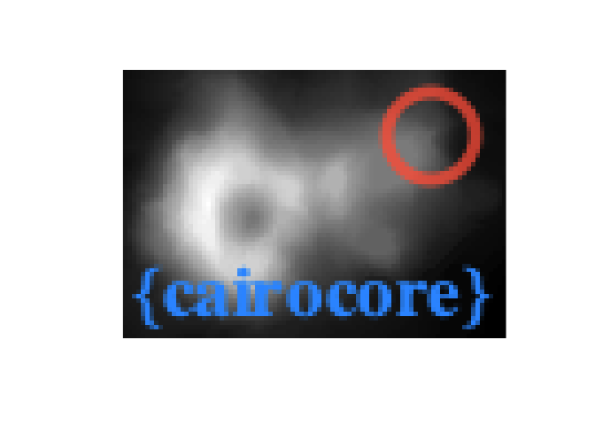

<!-- README.md is generated from README.Rmd. Please edit that file -->

```{r, include = FALSE}
knitr::opts_chunk$set(
  collapse = TRUE,
  comment = "#>",
  fig.path = "man/figures/README-",
  out.width = "80%"
)


#~~~~~~~~~~~~~~~~~~~~~~~~~~~~~~~~~~~~~~~~~~~~~~~~~~~~~~~~~~~~~~~~~~~~~~~~~~~~~
# Generate the pkgdown documentation
#~~~~~~~~~~~~~~~~~~~~~~~~~~~~~~~~~~~~~~~~~~~~~~~~~~~~~~~~~~~~~~~~~~~~~~~~~~~~~
if (FALSE) {
  pkgdown::build_site(override = list(destination = "../coolbutuseless.github.io/package/cairocore"))
}


library(cairocore)
```

# cairocore

<!-- badges: start -->

[](https://github.com/coolbutuseless/cairocore/actions)
<!-- badges: end -->

`cairocore` provides a canvas and tools for fast 2d drawing operations.

It provides a low-level wrapper around the [cariographics](https://www.cairographics.org/) 
2D graphics library (written in C) which provides drawing operations
and related functions, with consistent output on multiple platforms and output 
media (e.g. SVG, PDF, PNG etc).

This package is *not* a graphics device - you can't plot to it.  Instead it 
provides a canvas for directly drawing shapes and text.


<div>




  
</div>

<div style="clear: both;" />


#### Key Features

* Very fast line and shape drawing
* Convert canvas surface to/from R arrays - this means you can draw on an array 
  from within R
* Alpha-blending and anti-aliasing
* Direct control of what pixels get put on a canvas i.e. not having to pass through 
  an intermediate plotting step (e.g. ggplot) or graphics device (e.g. png())


## Package Philosophy

`cairocore` is a one-to-one mapping from R functions to C functions in the  [cariographics](https://www.cairographics.org/)
C library.

This package will remain very "C-like", but other packages are
welcome to wrap this `cairocore` to enable more idiomatic R programming styles.

One such wrapper is [cairobasic](https://github.com/coolbutuseless/cairobasic) which offers a
subset of the possible drawing operations with a friendlier interface.


## Installation Pre-requisite: Cairographics C library + headers

* `CairoGraphics` library installed
* See [CairoGraphics downloads page](https://www.cairographics.org/download/) 
for more information on how this might work on your platform.

<details>
<summary> Install CairoGraphics on Mac OSX </summary>

* Using [homebrew](https://brew.sh/) - `brew install cairo` (this works on my Mac)
* Using [MacPorts]() - `sudo port install cairo`
* Using [fink](sudo apt-get install cairo)

</details>

<details>
<summary> Install CairoGraphics on Linux </summary>

* Debian/Ubuntu - `sudo apt-get install libcairo2-dev`
* Fedora - `sudo yum install cairo-devel`
* openSUSE - `zypper install cairo-devel`

</details>

<details>
<summary> Install CairoGraphics on Windows </summary>

I haven't been able to test any of the windows techniques - if you are a windows user,
please let me know what worked for you!

* [CairoGraphics downloads page](https://www.cairographics.org/download/) 
for more information
* Try the following:
    * [Rtools/pacman](https://github.com/r-windows/docs/blob/master/rtools40.md#system-libraries-and-pacman)
    * [rwinlib](https://github.com/rwinlib/cairo)
    * [winget](https://github.com/microsoft/winget-cli)

</details>


## Installation

You can install from [GitHub](https://github.com/coolbutuseless/cairocore) with:

``` r
# install.package('remotes')
remotes::install_github('coolbutuseless/cairocore')
```


## Documentation + Tutorials

`cairocore` behaves almost identically to the `CairoGraphics` C library and in 
many cases examples from the internet (which are all in C code) may be lightly modified and used as R code.

The documentation for `cairocore` is mostly a direct translation of the 
[`CairoGraphics` documentation](https://www.cairographics.org/manual/) and 
has been extracted from the C source files.


A great tutorial on using CairoGraphics in C is from [zetcode](http://zetcode.com/gfx/cairo/).


## Vignettes

I've tried to highlight a few interesting features of CairoGrapihcs in the vignettes, 
but the library is huge and I can't cover all of it here.

Hopefully there are enough code examples to get you started!

* [Creating patterns](https://coolbutuseless.github.io/package/cairocore/articles/demo-creating-and-using-patterns.html)
* [Drawing on R arrays](https://coolbutuseless.github.io/package/cairocore/articles/demo-drawing-on-arrays.html) create a drawing canvas from an R array and draw on it
* [Drawing simple shapes](https://coolbutuseless.github.io/package/cairocore/articles/demo-drawing-simple-shapes.html) 
* [Image output formats](https://coolbutuseless.github.io/package/cairocore/articles/demo-image-output-formats.html)
* [Using Transforms](https://coolbutuseless.github.io/package/cairocore/articles/demo-transforms.html) by default CairoGraphics considers the origin to be the top left of the page.  This vignette sets the transformation matrix on a surface such that the bottom left corner is considered the origin.
* [Vectorised functions](https://coolbutuseless.github.io/package/cairocore/articles/demo-vectorised-functions.html) there are some custom functions for drawing multitudes of the same type of element. There is a speed advantage in looping over data within C rather than within R.
* [Technical - enums in C](https://coolbutuseless.github.io/package/cairocore/articles/technical-C-enums-in-R.html)
* [Technical - pointers in C](https://coolbutuseless.github.io/package/cairocore/articles/technical-C-pointers-in-R.html)
* [Technical - structs in C](https://coolbutuseless.github.io/package/cairocore/articles/technical-C-structs-in-R.html)


## Example - Using `cairocore` as a drawing canvas


<details>
<summary> Click to show/hide code </summary>

```{r}
library(cairocore)

#~~~~~~~~~~~~~~~~~~~~~~~~~~~~~~~~~~~~~~~~~~~~~~~~~~~~~~~~~~~~~~~~~~~~~~~~~~~~~
# Create a surface to draw on.
#~~~~~~~~~~~~~~~~~~~~~~~~~~~~~~~~~~~~~~~~~~~~~~~~~~~~~~~~~~~~~~~~~~~~~~~~~~~~~
width  <- 800
height <- 400

surface <- cairo_image_surface_create(
  format = cairo_format_t$CAIRO_FORMAT_ARGB32, 
  width  = width,
  height = height
)

#~~~~~~~~~~~~~~~~~~~~~~~~~~~~~~~~~~~~~~~~~~~~~~~~~~~~~~~~~~~~~~~~~~~~~~~~~~~~~
# Every surface must have a context in order to operate on it.
# For faster operation, antialiasing can be switched off
#~~~~~~~~~~~~~~~~~~~~~~~~~~~~~~~~~~~~~~~~~~~~~~~~~~~~~~~~~~~~~~~~~~~~~~~~~~~~~
cr <- cairo_create(surface)

#~~~~~~~~~~~~~~~~~~~~~~~~~~~~~~~~~~~~~~~~~~~~~~~~~~~~~~~~~~~~~~~~~~~~~~~~~~~~~
# Clear the surface to a light grey
#~~~~~~~~~~~~~~~~~~~~~~~~~~~~~~~~~~~~~~~~~~~~~~~~~~~~~~~~~~~~~~~~~~~~~~~~~~~~~
cairo_set_source_rgb(cr, 0.98, 0.98, 0.98)
cairo_paint(cr)

#~~~~~~~~~~~~~~~~~~~~~~~~~~~~~~~~~~~~~~~~~~~~~~~~~~~~~~~~~~~~~~~~~~~~~~~~~~~~~
# Draw some red lines
#~~~~~~~~~~~~~~~~~~~~~~~~~~~~~~~~~~~~~~~~~~~~~~~~~~~~~~~~~~~~~~~~~~~~~~~~~~~~~
cairo_set_source_rgba(cr, 1, 0, 0, 0.02)
for (i in seq(width)) {
  cairo_move_to(cr, 0, 0)
  cairo_line_to(cr, i, height)
  cairo_stroke(cr)
}

#~~~~~~~~~~~~~~~~~~~~~~~~~~~~~~~~~~~~~~~~~~~~~~~~~~~~~~~~~~~~~~~~~~~~~~~~~~~~~
# Draw some rectangles
#~~~~~~~~~~~~~~~~~~~~~~~~~~~~~~~~~~~~~~~~~~~~~~~~~~~~~~~~~~~~~~~~~~~~~~~~~~~~~
cairo_set_line_width(cr, 0.5)
cairo_set_source_rgba(cr, 0, 0, 1, 0.2)

for (j in seq(1, height, 22)) {
  for (i in seq(width/2, width, 22)) {
    cairo_rectangle(cr, i, j, 20, 20)
    cairo_fill(cr)
  }
}


#~~~~~~~~~~~~~~~~~~~~~~~~~~~~~~~~~~~~~~~~~~~~~~~~~~~~~~~~~~~~~~~~~~~~~~~~~~~~~
# Draw green circles
#~~~~~~~~~~~~~~~~~~~~~~~~~~~~~~~~~~~~~~~~~~~~~~~~~~~~~~~~~~~~~~~~~~~~~~~~~~~~~
for (x in seq(1, width/3, 50)) {
  for (y in seq(height/2, height, 50)) {
    cairo_set_source_rgba(cr, 0, 0.5, 0, 0.1)
    cairo_arc(cr, x, y, radius = 20, 0, 2*pi)
    cairo_fill(cr)
  }
}

#~~~~~~~~~~~~~~~~~~~~~~~~~~~~~~~~~~~~~~~~~~~~~~~~~~~~~~~~~~~~~~~~~~~~~~~~~~~~~
# Get the image surface as a raster
#~~~~~~~~~~~~~~~~~~~~~~~~~~~~~~~~~~~~~~~~~~~~~~~~~~~~~~~~~~~~~~~~~~~~~~~~~~~~~
raster_out <- cairo_image_surface_get_raster(surface, nchannel = 3)
plot(raster_out, interpolate = FALSE)

#~~~~~~~~~~~~~~~~~~~~~~~~~~~~~~~~~~~~~~~~~~~~~~~~~~~~~~~~~~~~~~~~~~~~~~~~~~~~~
# Save the surface as a PNG
#~~~~~~~~~~~~~~~~~~~~~~~~~~~~~~~~~~~~~~~~~~~~~~~~~~~~~~~~~~~~~~~~~~~~~~~~~~~~~
cairo_surface_write_to_png(surface, tempfile(fileext = ".png"))
```

</details>


## Example - drawing 10,000 alpha blended lines


<details>
<summary> Click to show/hide code </summary>

```{r}
library(cairocore)

#~~~~~~~~~~~~~~~~~~~~~~~~~~~~~~~~~~~~~~~~~~~~~~~~~~~~~~~~~~~~~~~~~~~~~~~~~~~~~
# Calculate the end coordinates of a lot of line segments
#~~~~~~~~~~~~~~~~~~~~~~~~~~~~~~~~~~~~~~~~~~~~~~~~~~~~~~~~~~~~~~~~~~~~~~~~~~~~~
width  <- 1000
height <- 500
N      <- 10000
t      <- seq(0, 2*pi, length.out = N)
x1     <- width  * sin(t)
x2     <- width  * sin(2 * t + pi/2)
y1     <- height * cos(t)
y2     <- height * cos(4*t + pi/2)


#~~~~~~~~~~~~~~~~~~~~~~~~~~~~~~~~~~~~~~~~~~~~~~~~~~~~~~~~~~~~~~~~~~~~~~~~~~~~~
# Create a surface to draw on.
#~~~~~~~~~~~~~~~~~~~~~~~~~~~~~~~~~~~~~~~~~~~~~~~~~~~~~~~~~~~~~~~~~~~~~~~~~~~~~
surface <- cairo_image_surface_create(
  format = cairo_format_t$CAIRO_FORMAT_ARGB32, 
  width  = width,
  height = height
)

#~~~~~~~~~~~~~~~~~~~~~~~~~~~~~~~~~~~~~~~~~~~~~~~~~~~~~~~~~~~~~~~~~~~~~~~~~~~~~
# Every surface must have a context in order to operate on it.
# For faster operation, antialiasing can be switched off
#~~~~~~~~~~~~~~~~~~~~~~~~~~~~~~~~~~~~~~~~~~~~~~~~~~~~~~~~~~~~~~~~~~~~~~~~~~~~~
cr <- cairo_create(surface)
# cairo_set_antialias(cr, cairo_antialias_t$CAIRO_ANTIALIAS_NONE)

#~~~~~~~~~~~~~~~~~~~~~~~~~~~~~~~~~~~~~~~~~~~~~~~~~~~~~~~~~~~~~~~~~~~~~~~~~~~~~
# Clear the surface to a light grey
#~~~~~~~~~~~~~~~~~~~~~~~~~~~~~~~~~~~~~~~~~~~~~~~~~~~~~~~~~~~~~~~~~~~~~~~~~~~~~
cairo_set_source_rgb(cr, 0.98, 0.98, 0.98)
cairo_paint(cr)

#~~~~~~~~~~~~~~~~~~~~~~~~~~~~~~~~~~~~~~~~~~~~~~~~~~~~~~~~~~~~~~~~~~~~~~~~~~~~~
# Set the drawing colour for subsequent operations
#~~~~~~~~~~~~~~~~~~~~~~~~~~~~~~~~~~~~~~~~~~~~~~~~~~~~~~~~~~~~~~~~~~~~~~~~~~~~~
cairo_set_source_rgba(cr, 0.2, 0.3, 1, 0.01)

#~~~~~~~~~~~~~~~~~~~~~~~~~~~~~~~~~~~~~~~~~~~~~~~~~~~~~~~~~~~~~~~~~~~~~~~~~~~~~
# Draw each line - 
#   this seems laborious but it is idiomatic C/cairo programming style
#~~~~~~~~~~~~~~~~~~~~~~~~~~~~~~~~~~~~~~~~~~~~~~~~~~~~~~~~~~~~~~~~~~~~~~~~~~~~~
for (i in seq(N)) {
  cairo_move_to(cr, x1[i], y1[i])
  cairo_line_to(cr, x2[i], y2[i])
  cairo_stroke(cr)
}

#~~~~~~~~~~~~~~~~~~~~~~~~~~~~~~~~~~~~~~~~~~~~~~~~~~~~~~~~~~~~~~~~~~~~~~~~~~~~~
# Write some text on the cairo surface
# `cairo_font_slant_t` and `cairo_font_weight_t` are enums in C which have 
# been encoded as lists in R.
#~~~~~~~~~~~~~~~~~~~~~~~~~~~~~~~~~~~~~~~~~~~~~~~~~~~~~~~~~~~~~~~~~~~~~~~~~~~~~
cairo_select_font_face (
  cr, 
  family = "sans", 
  slant  = cairo_font_slant_t$CAIRO_FONT_SLANT_NORMAL, 
  weight = cairo_font_weight_t$CAIRO_FONT_WEIGHT_BOLD
)

cairo_set_font_size(cr, 57.0)
cairo_set_source_rgba(cr, 0, 0, 0, 0.3) 
cairo_move_to (cr, 5.0, 60.0)
cairo_show_text (cr, "{cairocore}")

#~~~~~~~~~~~~~~~~~~~~~~~~~~~~~~~~~~~~~~~~~~~~~~~~~~~~~~~~~~~~~~~~~~~~~~~~~~~~~
# Get the image surface as a raster
#~~~~~~~~~~~~~~~~~~~~~~~~~~~~~~~~~~~~~~~~~~~~~~~~~~~~~~~~~~~~~~~~~~~~~~~~~~~~~
raster_out <- cairo_image_surface_get_raster(surface, nchannel = 3)
plot(raster_out, interpolate = FALSE)
```

</details>


## Example - taking an array in R, drawing on it, returning it to R


<details>
<summary> Click to show/hide code </summary>

```{r}
library(cairocore)

#~~~~~~~~~~~~~~~~~~~~~~~~~~~~~~~~~~~~~~~~~~~~~~~~~~~~~~~~~~~~~~~~~~~~~~~~~~~~~
# Let's grab the volcano
#~~~~~~~~~~~~~~~~~~~~~~~~~~~~~~~~~~~~~~~~~~~~~~~~~~~~~~~~~~~~~~~~~~~~~~~~~~~~~
arr <- (t(volcano) - min(volcano))/(max(volcano) - min(volcano))
plot(as.raster(arr), interpolate = FALSE)
```


```{r}
#~~~~~~~~~~~~~~~~~~~~~~~~~~~~~~~~~~~~~~~~~~~~~~~~~~~~~~~~~~~~~~~~~~~~~~~~~~~~~
# Initialise a surface from the array
#~~~~~~~~~~~~~~~~~~~~~~~~~~~~~~~~~~~~~~~~~~~~~~~~~~~~~~~~~~~~~~~~~~~~~~~~~~~~~
surface <- cairo_image_surface_create_from_array(arr)
cr      <- cairo_create(surface)

#~~~~~~~~~~~~~~~~~~~~~~~~~~~~~~~~~~~~~~~~~~~~~~~~~~~~~~~~~~~~~~~~~~~~~~~~~~~~~
# Draw a circle on the cairo surface
#~~~~~~~~~~~~~~~~~~~~~~~~~~~~~~~~~~~~~~~~~~~~~~~~~~~~~~~~~~~~~~~~~~~~~~~~~~~~~
cairo_arc(cr, 70, 15, 10, 0, 2*pi)
cairo_set_line_width(cr, 3);
cairo_set_source_rgba(cr, 255/255, 99/255, 71/255, 0.8)
cairo_stroke(cr)

#~~~~~~~~~~~~~~~~~~~~~~~~~~~~~~~~~~~~~~~~~~~~~~~~~~~~~~~~~~~~~~~~~~~~~~~~~~~~~
# Write some text on the cairo surface
#~~~~~~~~~~~~~~~~~~~~~~~~~~~~~~~~~~~~~~~~~~~~~~~~~~~~~~~~~~~~~~~~~~~~~~~~~~~~~
cairo_select_font_face (cr, "serif", cairo_font_slant_t$CAIRO_FONT_SLANT_NORMAL, cairo_font_weight_t$CAIRO_FONT_WEIGHT_BOLD)
cairo_set_font_size (cr, 17.0)
cairo_set_source_rgb (cr, 0.2, 0.6, 1.0) 
cairo_move_to (cr, 2.0, 56.0)
cairo_show_text (cr, "{cairocore}")

#~~~~~~~~~~~~~~~~~~~~~~~~~~~~~~~~~~~~~~~~~~~~~~~~~~~~~~~~~~~~~~~~~~~~~~~~~~~~~
# Fetch the drawing surface as an array
#~~~~~~~~~~~~~~~~~~~~~~~~~~~~~~~~~~~~~~~~~~~~~~~~~~~~~~~~~~~~~~~~~~~~~~~~~~~~~
array_out <- cairo_image_surface_get_array(surface=surface)
plot(as.raster(array_out), interpolate = FALSE)
```


</details>


## Related Software

* The R [Cairo](https://cran.r-project.org/package=Cairo) package uses the CairoGraphics library 
internally to provide graphics output devices for plotting.  
* The R [cairoDevice](https://cran.r-project.org/package=cairoDevice) package appears to be almost
identical to the `{Cairo}` package in that it provides graphics output devices for plotting.


## Acknowledgements

* R Core for developing and maintaining R
* CRAN maintainers, for patiently shepherding packages onto CRAN and maintaining
  the repository
