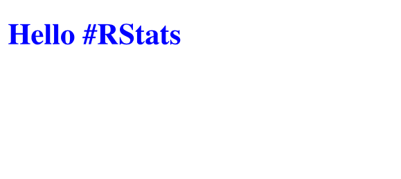
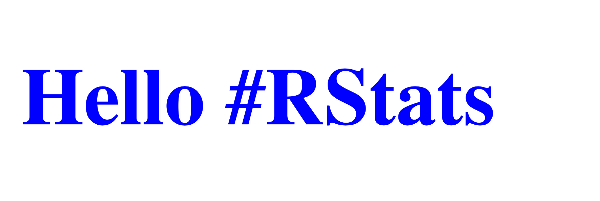

```{r, include = FALSE}
knitr::opts_chunk$set(
  collapse = TRUE,
  comment = "#>"
)
```

```{r setup}
library(cairocore)
```

# Introduction

In the following examples, the image is always drawn in an identical way.  The 
only difference is the function used to set up the surface i.e.

* `cairo_svg_surface_create()` for SVG 
* `cairo_pdf_surface_create()` for PDF
* `cairo_ps_surface_create()` for Postscript


## SVG

```{r eval = FALSE}
#~~~~~~~~~~~~~~~~~~~~~~~~~~~~~~~~~~~~~~~~~~~~~~~~~~~~~~~~~~~~~~~~~~~~~~~~~~~~
# Initiate surface
#~~~~~~~~~~~~~~~~~~~~~~~~~~~~~~~~~~~~~~~~~~~~~~~~~~~~~~~~~~~~~~~~~~~~~~~~~~~~
surface <- cairo_svg_surface_create ("working/output.svg", 240, 80);
cr      <- cairo_create (surface);


#~~~~~~~~~~~~~~~~~~~~~~~~~~~~~~~~~~~~~~~~~~~~~~~~~~~~~~~~~~~~~~~~~~~~~~~~~~~~
# Set up text
#~~~~~~~~~~~~~~~~~~~~~~~~~~~~~~~~~~~~~~~~~~~~~~~~~~~~~~~~~~~~~~~~~~~~~~~~~~~~
cairo_select_font_face (cr, "serif",
                        cairo_font_slant_t$CAIRO_FONT_SLANT_NORMAL,
                        cairo_font_weight_t$CAIRO_FONT_WEIGHT_BOLD);

cairo_set_font_size (cr, 32.0);
cairo_set_source_rgb (cr, 0.0, 0.0, 1.0);
cairo_move_to (cr, 10.0, 50.0);
cairo_show_text (cr, "Hello #RStats");


#~~~~~~~~~~~~~~~~~~~~~~~~~~~~~~~~~~~~~~~~~~~~~~~~~~~~~~~~~~~~~~~~~~~~~~~~~~~~
# Ask the surface to be shown
#~~~~~~~~~~~~~~~~~~~~~~~~~~~~~~~~~~~~~~~~~~~~~~~~~~~~~~~~~~~~~~~~~~~~~~~~~~~~
cairo_show_page(cr)
cairo_surface_flush(surface)
cairo_surface_finish(surface)
```





## PDF

```{r eval = FALSE}
#~~~~~~~~~~~~~~~~~~~~~~~~~~~~~~~~~~~~~~~~~~~~~~~~~~~~~~~~~~~~~~~~~~~~~~~~~~~~
# Initiate surface
#~~~~~~~~~~~~~~~~~~~~~~~~~~~~~~~~~~~~~~~~~~~~~~~~~~~~~~~~~~~~~~~~~~~~~~~~~~~~
surface <- cairo_pdf_surface_create ("working/output.pdf", 240, 80);
cr      <- cairo_create (surface);


#~~~~~~~~~~~~~~~~~~~~~~~~~~~~~~~~~~~~~~~~~~~~~~~~~~~~~~~~~~~~~~~~~~~~~~~~~~~~
# Set up text
#~~~~~~~~~~~~~~~~~~~~~~~~~~~~~~~~~~~~~~~~~~~~~~~~~~~~~~~~~~~~~~~~~~~~~~~~~~~~
cairo_select_font_face (cr, "serif",
                        cairo_font_slant_t$CAIRO_FONT_SLANT_NORMAL,
                        cairo_font_weight_t$CAIRO_FONT_WEIGHT_BOLD);

cairo_set_font_size (cr, 32.0);
cairo_set_source_rgb (cr, 0.0, 0.0, 1.0);
cairo_move_to (cr, 10.0, 50.0);
cairo_show_text (cr, "Hello #RStats");


#~~~~~~~~~~~~~~~~~~~~~~~~~~~~~~~~~~~~~~~~~~~~~~~~~~~~~~~~~~~~~~~~~~~~~~~~~~~~
# Ask the surface to be shown
#~~~~~~~~~~~~~~~~~~~~~~~~~~~~~~~~~~~~~~~~~~~~~~~~~~~~~~~~~~~~~~~~~~~~~~~~~~~~
cairo_show_page(cr)
cairo_surface_flush(surface)
cairo_surface_finish(surface)
```




## Postscript

```{r eval = FALSE}
#~~~~~~~~~~~~~~~~~~~~~~~~~~~~~~~~~~~~~~~~~~~~~~~~~~~~~~~~~~~~~~~~~~~~~~~~~~~~
# Initiate surface
#~~~~~~~~~~~~~~~~~~~~~~~~~~~~~~~~~~~~~~~~~~~~~~~~~~~~~~~~~~~~~~~~~~~~~~~~~~~~
surface <- cairo_ps_surface_create ("working/output.ps", 240, 80);
cr      <- cairo_create (surface);


#~~~~~~~~~~~~~~~~~~~~~~~~~~~~~~~~~~~~~~~~~~~~~~~~~~~~~~~~~~~~~~~~~~~~~~~~~~~~
# Set up text
#~~~~~~~~~~~~~~~~~~~~~~~~~~~~~~~~~~~~~~~~~~~~~~~~~~~~~~~~~~~~~~~~~~~~~~~~~~~~
cairo_select_font_face (cr, "serif",
                        cairo_font_slant_t$CAIRO_FONT_SLANT_NORMAL,
                        cairo_font_weight_t$CAIRO_FONT_WEIGHT_BOLD);

cairo_set_font_size (cr, 32.0);
cairo_set_source_rgb (cr, 0.0, 0.0, 1.0);
cairo_move_to (cr, 10.0, 50.0);
cairo_show_text (cr, "Hello #RStats");


#~~~~~~~~~~~~~~~~~~~~~~~~~~~~~~~~~~~~~~~~~~~~~~~~~~~~~~~~~~~~~~~~~~~~~~~~~~~~
# Ask the surface to be shown
#~~~~~~~~~~~~~~~~~~~~~~~~~~~~~~~~~~~~~~~~~~~~~~~~~~~~~~~~~~~~~~~~~~~~~~~~~~~~
cairo_show_page(cr)
cairo_surface_flush(surface)
cairo_surface_finish(surface)
```


